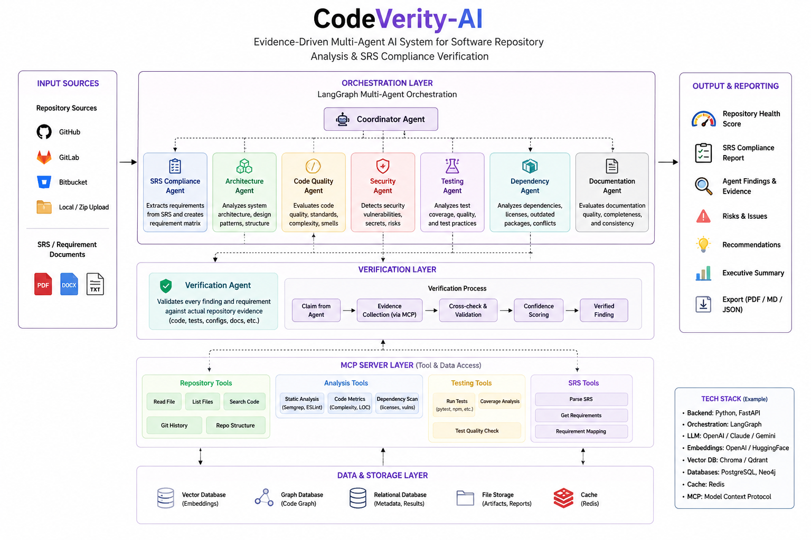

# CodeVerity-AI

An evidence-driven multi-agent AI system that analyzes software repositories and verifies SRS compliance, code quality, security, architecture, testing, dependencies, and maintainability using evidence-based analysis.

## Overview

CodeVerity-AI provides comprehensive software verification capabilities through:

- **SRS Compliance Verification** - Ensures code meets Software Requirements Specification
- **Code Quality Analysis** - AST-based quality assessment
- **Security Analysis** - Identifies security vulnerabilities and best practices
- **Architecture Verification** - Validates architectural patterns and structure
- **Testing Evaluation** - Analyzes test coverage and quality
- **Dependency Management** - Tracks and evaluates dependencies

## System Architecture



## Getting Started

### Prerequisites
- Docker and Docker Compose
- Python 3.8+

### Installation

```bash
# Clone the repository
git clone <repository-url>
cd CodeVerity-ai

# Install dependencies
pip install -r requirements.txt
```

### Running with Docker

```bash
docker compose up --build
```

## Project Structure

- `src/` - Main source code
  - `agents/` - AI agents for different verification tasks
  - `orchestrator/` - Workflow orchestration
  - `reporting/` - Report generation and scoring
  - `tools/` - Analysis tools
- `config/` - Configuration files
- `tests/` - Test suite
- `eval/` - Evaluation scripts

## License

MIT
